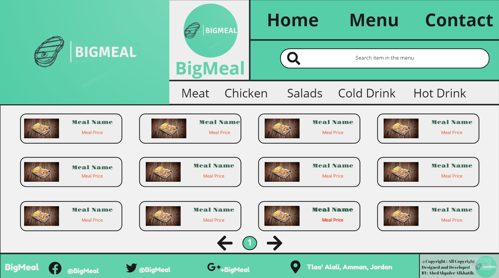

# My-restaurant

---

Title: "Task2"

Author: "Abedalqader Alkhatib"

Date: "1/17/2022"

---

> I create a wireframe for website using Miro, for restaurant menu name <ins> Big Meal</ins>.
> The wireframe include navigation bar with taps:
>
> - **Home** : Home Page.
> - **Menu** : Menu Page.
> - **Contact** : Contact Page.
>
> The Menu Page Include theese sctions:
>
> - **Meat.**
> - **Chicken.**
> - **Salads.**
> - **Cold Drink.**
> - **Hot Drink.**

## The Wire Frame

